# SeniorCare Launcher

Launcher Android dành cho người lớn tuổi với giao diện đơn giản, chữ lớn, dễ thao tác và tích hợp các tính năng thiết yếu như cuộc gọi, danh bạ, tin nhắn, thời tiết và quản lý ứng dụng.

---

# 📑 Mục lục

* [🚀 Khởi động lần đầu & Cấp quyền](#-khởi-động-lần-đầu--cấp-quyền)

  * [Thiết lập Launcher mặc định](#11-thiết-lập-launcher-mặc-định)
  * [Cấp quyền truy cập](#12-cấp-quyền-truy-cập)
* [🏠 Màn hình chính](#-màn-hình-chính)
* [📱 Quản lý ứng dụng](#-quản-lý-ứng-dụng)
* [⚙️ Cài đặt tùy chỉnh giao diện](#️-cài-đặt-tùy-chỉnh-giao-diện)
* [💬 Tin nhắn](#-tin-nhắn)
* [📞 Danh bạ & Cuộc gọi](#-danh-bạ--cuộc-gọi)
* [🔊 Nút âm lượng](#-nút-âm-lượng)
* [🚀 Mở ứng dụng](#-mở-ứng-dụng)

---

# 🚀 Khởi động lần đầu & Cấp quyền

## 1.1 Thiết lập Launcher mặc định

Khi mở ứng dụng lần đầu, SeniorCare sẽ hỏi người dùng có muốn đặt làm Launcher mặc định hay không.

### Hộp thoại yêu cầu

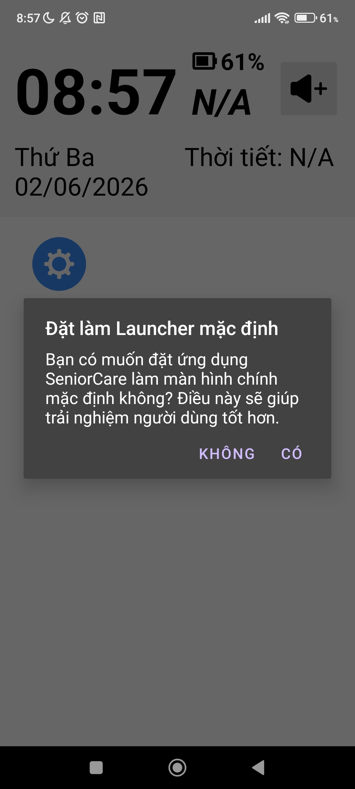

### Màn hình cài đặt hệ thống

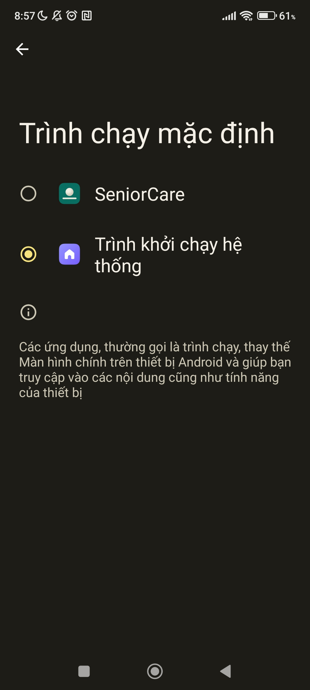

### Hướng dẫn

* Chọn **CÓ** để sử dụng SeniorCare làm màn hình chính mặc định.
* Chọn **KHÔNG** nếu muốn tiếp tục sử dụng Launcher hiện tại.

---

## 1.2 Cấp quyền truy cập

Ứng dụng cần một số quyền để hoạt động đầy đủ.

| Vị trí   | Hiển thị thời tiết và nhiệt độ theo vị trí hiện tại | 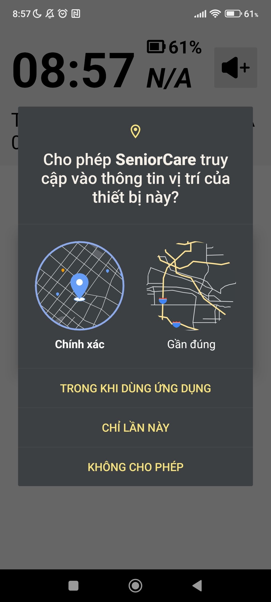  |

---

# 🏠 Màn hình chính

## 2.1 Giao diện mặc định

### Giao diện mẫu

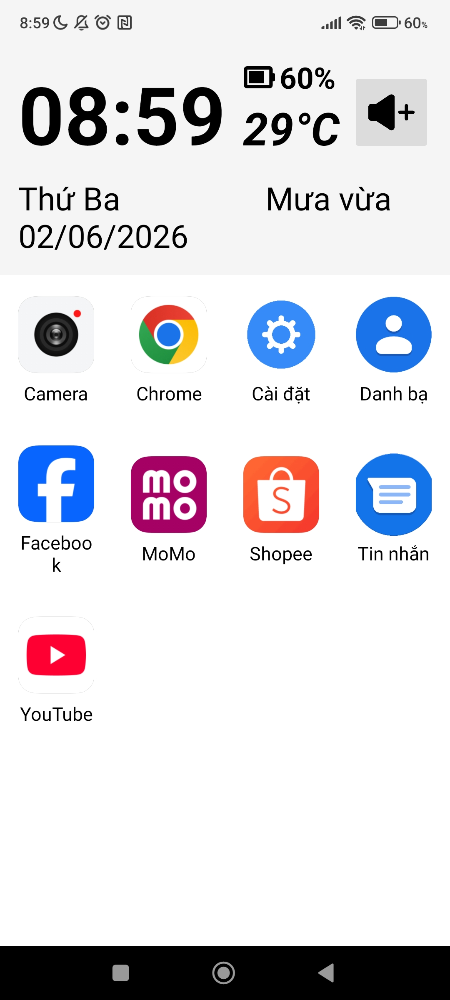

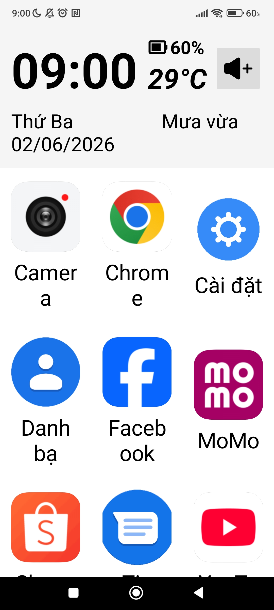

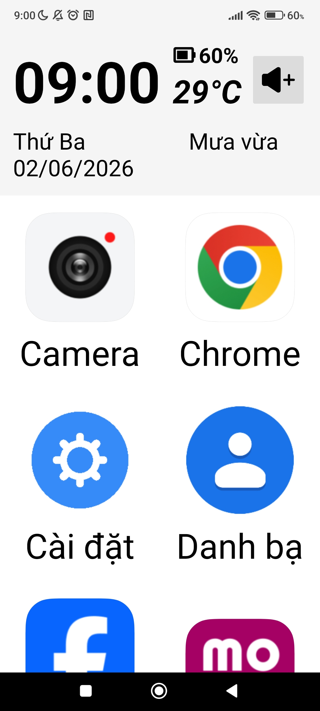

### Thành phần giao diện

| Biểu tượng | Chức năng                      |
| ---------- | ------------------------------ |
| ⏰          | Hiển thị thời gian thực        |
| 📅         | Hiển thị ngày và thứ hiện tại  |
| 🌤️        | Hiển thị thời tiết và nhiệt độ |
| 🔋         | Hiển thị phần trăm pin         |
| 📱         | Danh sách ứng dụng thường dùng |

---

# 📱 Quản lý ứng dụng

## 3.1 Chọn ứng dụng hiển thị

Người dùng có thể thêm hoặc bớt ứng dụng xuất hiện trên màn hình chính.

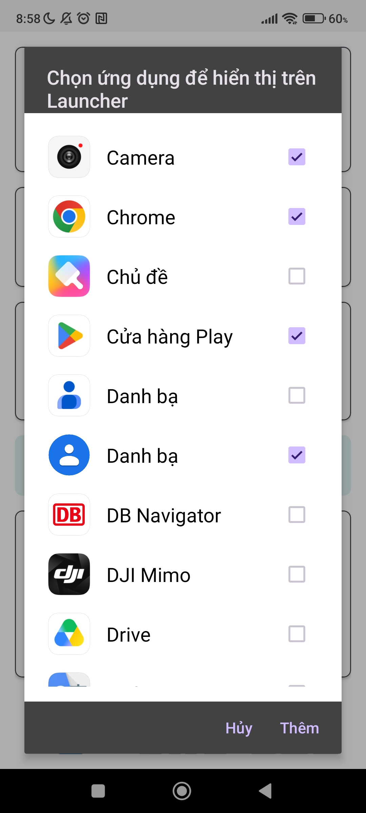

### Các bước thực hiện

```text
Cài đặt
   ↓
Quản lý ứng dụng
   ↓
Chọn / Bỏ chọn ứng dụng
   ↓
Nhấn "Thêm"
```

---

## 3.2 Xóa ứng dụng

Nhấn giữ ứng dụng để xóa khỏi màn hình chính.

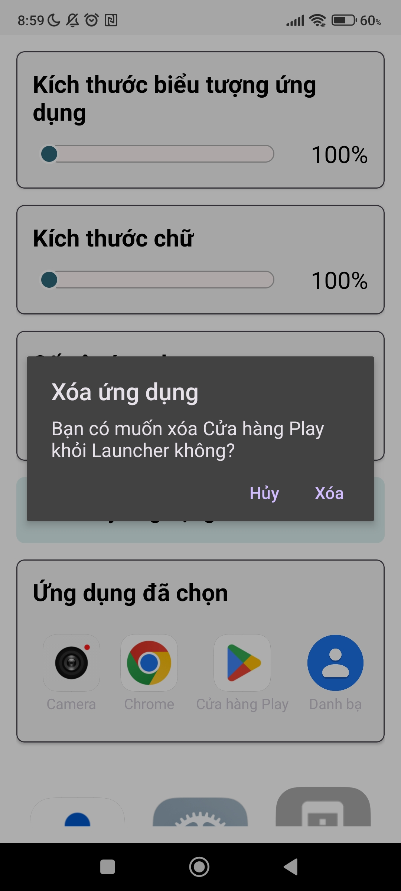
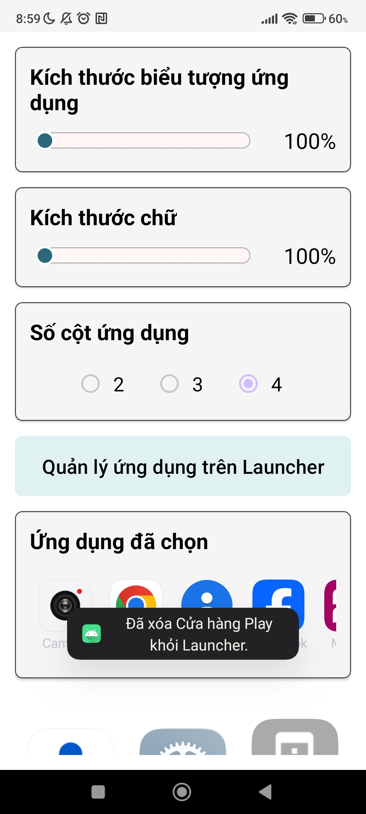

### Các bước thực hiện

```text
Nhấn giữ biểu tượng ứng dụng
          ↓
Hiện hộp thoại xác nhận
          ↓
Nhấn "Xóa"
```

---

# ⚙️ Cài đặt tùy chỉnh giao diện

## 4.1 Điều chỉnh Icon & Font Size

### Kích thước nhỏ (100%)

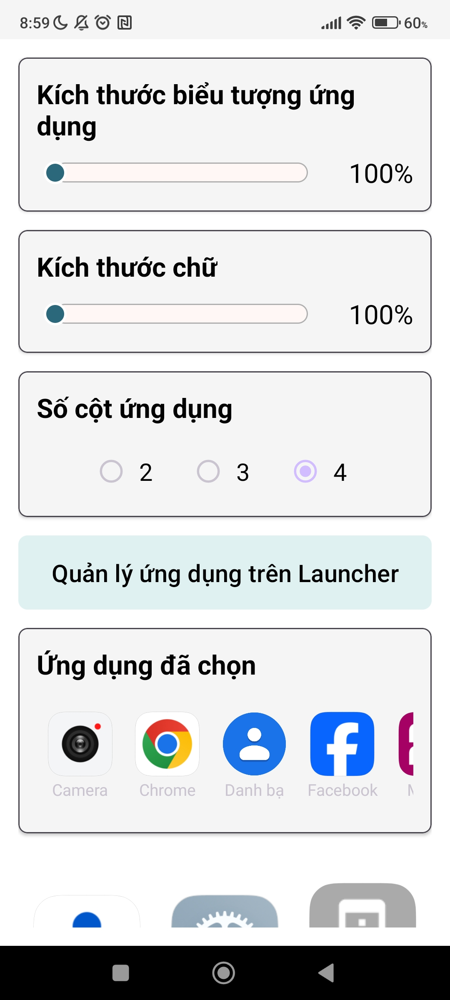

### Kích thước vừa (130%)

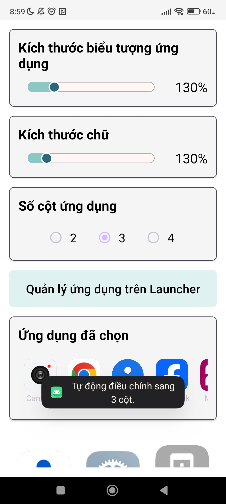

### Kích thước lớn (200%+)

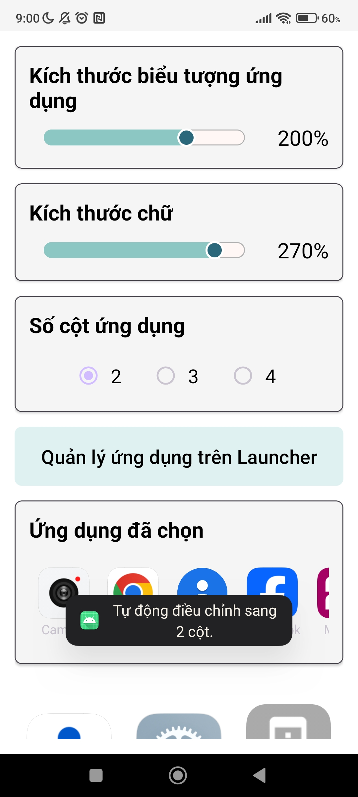

### Bảng thông số

| Thành phần | Khoảng giá trị |
| ---------- | -------------- |
| Icon Size  | 100% - 240%    |
| Font Size  | 100% - 300%    |

---

## 4.2 Chọn số cột hiển thị

### Giao diện 3 cột

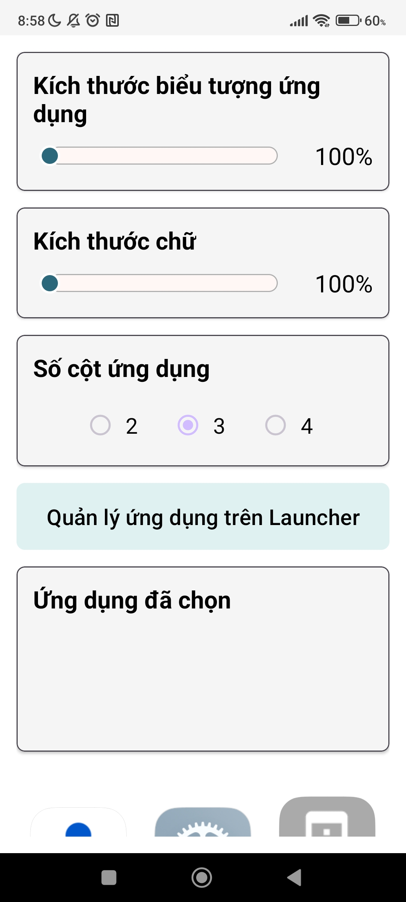

### Giao diện 4 cột

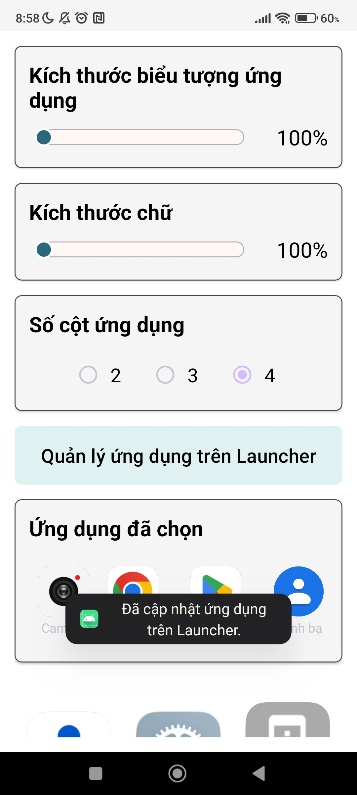

### Tự động điều chỉnh

Khi kích thước biểu tượng tăng lớn, hệ thống sẽ tự động giảm số cột để đảm bảo dễ nhìn và dễ thao tác.

```text
Icon càng lớn
        ↓
Số cột hiển thị giảm
        ↓
Khoảng cách giữa các ứng dụng tăng
```

---

# 💬 Tin nhắn

## 5.1 Mở danh sách tin nhắn

Ứng dụng cần một số quyền sau:
| Tin nhắn  | Hiển thị các tin nhắn              | 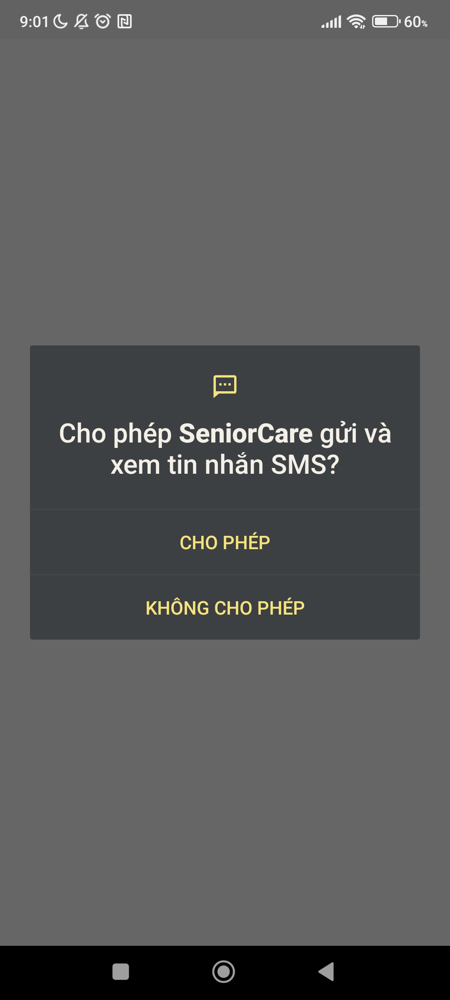 |

SeniorCare chỉ hiển thị tin nhắn từ những người có trong danh bạ nhằm hạn chế tin nhắn rác.

### Cách sử dụng

```text
Nhấn biểu tượng "Tin nhắn"
          ↓
Xem danh sách hội thoại
          ↓
Chọn người cần đọc tin
```

---

## 5.2 Chuẩn hóa số điện thoại

Để đối chiếu chính xác giữa Danh bạ và Tin nhắn, hệ thống sẽ chuẩn hóa số điện thoại.

```text
Số gốc
   ↓
Loại bỏ khoảng trắng, dấu -, dấu ()
   ↓
Chuẩn hóa đầu số
   ↓
Số điện thoại chuẩn
```

---

# 📞 Danh bạ & Cuộc gọi

Ứng dụng cần một số quyền sau:
| Danh bạ  | Hiển thị danh bạ và thực hiện cuộc gọi              | 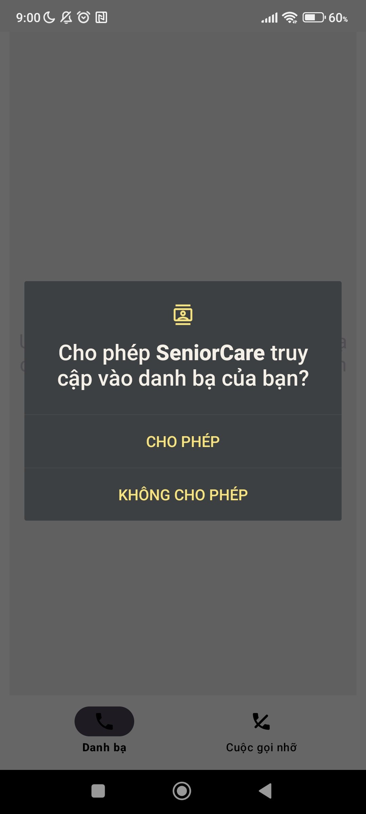 |
| Tin nhắn | Hiển thị tin nhắn từ người thân                     |  |
| Cuộc gọi | Hiển thị lịch sử cuộc gọi nhỡ                       | 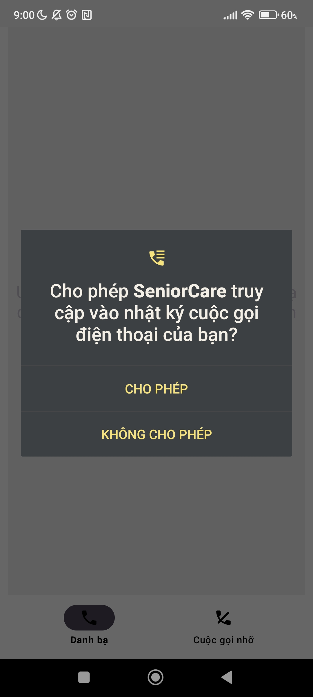 |

## 6.1 Tab Danh bạ


### Chức năng

* 📞 Gọi thường
* 💬 Gọi Zalo
(media/24.jpg)
---

## 6.2 Tab Cuộc gọi nhỡ


### Tính năng

* Nhóm theo ngày
* Hiển thị số lần gọi nhỡ
* Dễ dàng gọi lại

---

## 6.3 Chuyển đổi tab

Khi thực hiện cuộc gọi, người dùng có thể chọn ứng dụng gọi.


### Ví dụ

```text
Nhấn Gọi
    ↓
Hiện "Gọi bằng"
    ↓
Điện thoại hoặc Zalo
```

---

# 🔊 Nút âm lượng

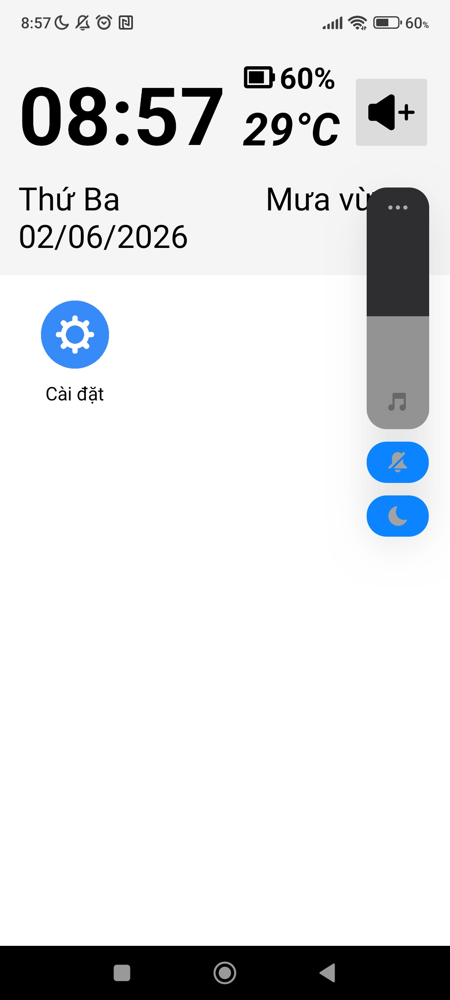

Người dùng có thể tăng hoặc giảm âm lượng bằng nút vật lý trên điện thoại.

### Quy tắc

* Nút ↑ : tăng 5%
* Nút ↓ : giảm 5%

### Ví dụ

```text
30%
 ↓
45%
 ↓
60%
 ↓
75%
```

---

# 🚀 Mở ứng dụng

## 8.1 Ứng dụng nội bộ

Ví dụ mở Tin nhắn, Danh bạ hoặc Cài đặt.

```java
Intent intent = new Intent(Intent.ACTION_MAIN);
intent.addCategory(Intent.CATEGORY_APP_MESSAGING);
startActivity(intent);
```

```java
Intent intent = new Intent(Intent.ACTION_MAIN);
intent.addCategory(Intent.CATEGORY_APP_CONTACTS);
startActivity(intent);
```

```java
Intent intent = new Intent(Settings.ACTION_SETTINGS);
startActivity(intent);
```

---

## 8.2 Ứng dụng bên ngoài


Mở ứng dụng bất kỳ được cài đặt trên thiết bị.

```java
PackageManager pm = getPackageManager();

Intent launchIntent =
    pm.getLaunchIntentForPackage(packageName);

if (launchIntent != null) {
    startActivity(launchIntent);
}
```

---

# ❤️ Mục tiêu của SeniorCare

* Chữ lớn, dễ đọc
* Thao tác đơn giản
* Hỗ trợ người lớn tuổi
* Hạn chế nhầm lẫn khi sử dụng điện thoại
* Truy cập nhanh các chức năng cần thiết

SeniorCare hướng tới trải nghiệm điện thoại thân thiện, an toàn và dễ tiếp cận cho người cao tuổi.
