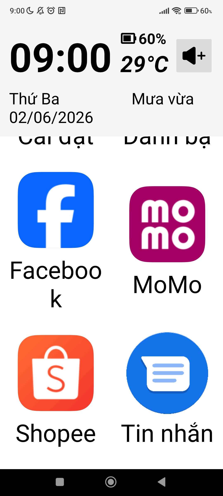
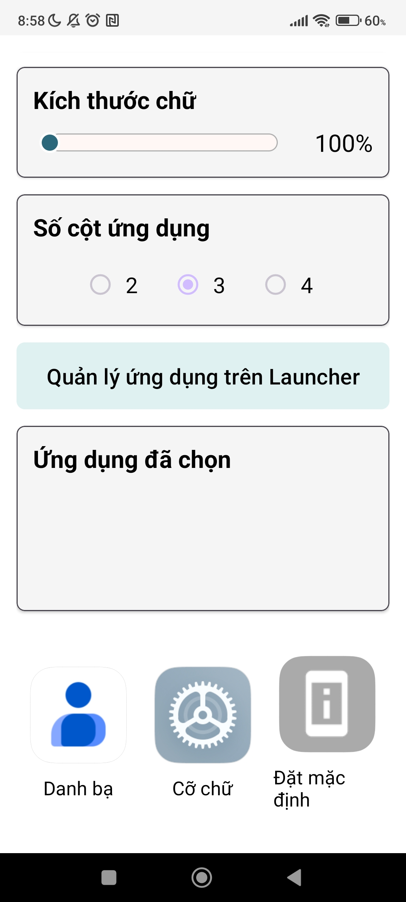

```markdown  
# SeniorCare Launcher - Hướng Dẫn Sử Dụng  

> Ứng dụng Launcher tối ưu hóa cho người cao tuổi với giao diện đơn giản, chữ to, icon rõ ràng  

---  

## 📋 Mục Lục  

- [1. Khởi động lần đầu & Cấp quyền](#1-khởi-động-lần-đầu--cấp-quyền)  
- [2. Màn hình chính](#2-màn-hình-chính-home-screen)  
- [3. Quản lý ứng dụng](#3-quản-lý-ứng-dụng)  
- [4. Cài đặt tùy chỉnh giao diện](#4-cài-đặt-tùy-chỉnh-giao-diện)  
- [5. Tin nhắn](#5-tin-nhắn-sms)  
- [6. Danh bạ & Cuộc gọi](#6-danh-bạ--cuộc-gọi)  
- [7. Nút âm lượng](#7-nút-tănggiảm-âm-lượng)  
- [8. Chuyển tiếp & Mở ứng dụng](#8-chuyển-tiếp--mở-ứng-dụng)  

---  

## 1. 🚀 Khởi động lần đầu & Cấp quyền  

### 1.1 🏠 Thiết lập Launcher mặc định  

Khi khởi động lần đầu, ứng dụng sẽ hiển thị dialog yêu cầu đặt SeniorCare làm launcher mặc định:  

#### Bước thiết lập:  

| Bước | Hình ảnh | Mô tả |  
|------|---------|-------|  
| **1** |  | Dialog "Đặt làm Launcher mặc định" |  
| **2** |  | Cài đặt "Trình chạy mặc định" |  

**Cách làm:**  
- ✅ Nhấn **"CÓ"** để áp dụng SeniorCare làm màn hình chính  
- ❌ Hoặc nhấn **"KHÔNG"** để cấu hình sau trong Cài đặt hệ thống  

---  

### 1.2 🔐 Cấp quyền truy cập  

Ứng dụng yêu cầu cấp các quyền sau để hoạt động đầy đủ:  

| Quyền | Mục đích | Ảnh minh họa |  
|:------|:--------|:-----------|  
| 📍 **Vị trí** (Location) | Lấy thông tin thời tiết |  |  
| 📇 **Danh bạ** (Contacts) | Hiển thị danh sách liên hệ |  |  
| 💬 **Tin nhắn** (SMS) | Lọc tin nhắn từ danh bạ |  |  
| ☎️ **Cuộc gọi** (Call Log) | Xem cuộc gọi nhỡ |  |  

> ⚠️ **Lưu ý:** Bạn có thể từ chối quyền và cấp sau, nhưng một số tính năng sẽ không hoạt động.  

---  

## 2. 🎨 Màn hình chính (Home Screen)  

### 2.1 Giao diện mặc định  

**Ảnh minh họa:**  

<table>  
<tr>  
<td align="center">  

  

</td>  
<td align="center">  

  

</td>  
<td align="center">  

  

</td>  
</tr>  
</table>  

**Các thành phần chính:**  

| Thành phần | Mô tả |  
|-----------|-------|  
| ⏰ **Thời gian thực** | `09:00` - Cập nhật mỗi phút via `BroadcastReceiver` `ACTION_TIME_TICK` |  
| 📅 **Ngày & Thứ** | `Thứ Ba 02/06/2026` - Định dạng tiếng Việt |  
| 🌤️ **Thời tiết & Nhiệt độ** | `Mưa vừa 29°C` - Cập nhật từ **OpenWeatherMap API** mỗi 30 phút |  
| 🔋 **Pin** | Hiển thị % pin và trạng thái sạc (Sạc / Pin yếu / Đầy...) |  
| 📱 **Danh sách ứng dụng** | Grid layout **4 cột** (mặc định) |  

---  

## 3. 📦 Quản lý ứng dụng  

### 3.1 ✅ Chọn ứng dụng hiển thị  

**Ảnh tham chiếu:**  

  

**Hướng dẫn:**  

1. Mở **Cài đặt** → Nhấn **"Quản lý ứng dụng"**  
2. Một dialog sẽ hiển thị danh sách tất cả ứng dụng đã cài  
3. ☑️ **Chọn/Bỏ chọn** ứng dụng muốn hiển thị trên launcher  
4. Loại trừ ứng dụng không cần thiết  
5. Nhấn **"Thêm"** để lưu  

**💾 Dữ liệu:**  
- Được lưu vào `SharedPreferences` dạng **JSON** (Gson)  
- Tự động đồng bộ với màn hình chính khi thay đổi  

---  

### 3.2 🗑️ Xóa ứng dụng khỏi Launcher  

**Ảnh tham chiếu:**  

  

**Cách làm:**  

1. **Long-click** (nhấn lâu) trên ứng dụng bạn muốn xóa  
2. Dialog xác nhận sẽ xuất hiện  
3. Nhấn **"Xóa"** để xác nhận  
4. Ứng dụng sẽ bị loại khỏi launcher ngay lập tức  

---  

## 4. ⚙️ Cài đặt tùy chỉnh giao diện  

### 4.1 📏 Điều chỉnh kích thước biểu tượng & chữ  

**Ảnh minh họa:**  

<table>  
<tr>  
<td align="center">  

**Nhỏ**  

  

</td>  
<td align="center">  

**Vừa**  

  

</td>  
<td align="center">  

**Lớn**  

  

</td>  
</tr>  
</table>  

**Cách điều chỉnh trong SettingsActivity:**  

| Cài đặt | Phạm vi | Mặc định | Công thức Mapping |  
|:--------|:--------|:---------|:-----------------|  
| **Icon Size** 📌 | 100% → 240% | 100dp | `actualPercentage = actualMin + (xmlProgress - SEEKBAR_XML_MIN) × scale` |  
| **Font Size** 🔤 | 100% → 300% | 16sp | Cùng công thức mapping |  

**🎯 Tính năng đặc biệt:**  
- 📌 **Làm tròn tới bội số 10**: Kéo sạch vị trí sẽ tự động làm tròn (VD: 175 → 180)  
- ⚡ **Cập nhật real-time**: Giao diện cập nhật ngay khi bạn thả SeekBar  

---  

### 4.2 📊 Chọn số cột hiển thị  

**Ảnh tham chiếu:**  

<table>  
<tr>  
<td align="center">  

**3 Cột**  

  

</td>  
<td align="center">  

**4 Cột**  

  

</td>  
</tr>  
</table>  

**Tùy chọn số cột:**  

```  
┌─────────────────────────┐  
│  2 cột (Compact)        │  ← Cho icon rất lớn  
│  3 cột (Cân bằng)       │  ← Mặc định  
│  4 cột (Chi tiết)       │  ← Hiển thị nhiều ứng dụng  
└─────────────────────────┘  
```  

**Logic tự động điều chỉnh:**  

```  
IF icon > 160% OR chữ > 220%  
    ➜ Tự động chuyển sang → 📍 2 CỘT  

ELSE IF icon > 110% OR chữ > 160%  
    ➜ Tự động chuyển sang → 📍 3 CỘT  

ELSE  
    ➜ Mặc định → 📍 4 CỘT  
```  

**📢 Thông báo tự động điều chỉnh:**  

  

> 💡 Toast sẽ hiển thị: **"Tự động điều chỉnh sang 2 cột"**  

---  

## 5. 📬 Tin nhắn (SMS)  

### 5.1 📲 Mở danh sách tin nhắn  

**Ảnh tham chiếu:** Nhấn icon **"Tin nhắn"** trên launcher  

**Hiển thị các tính năng:**  

- ✉️ **Chỉ tin từ danh bạ** - Loại bỏ spam từ số lạ  
- 📂 **Nhóm theo cuộc hội thoại** - Sắp xếp dễ dàng  
- 👤 **Người gửi** | 💬 **Nội dung** | 🕐 **Thời gian**  
- ⬇️ **Sắp xếp giảm dần** - Mới nhất hiển thị trước  

---  

### 5.2 🔢 Chuẩn hóa số điện thoại  

Phương pháp normalize số điện thoại để so sánh chính xác:  

```  
Số điện thoại gốc:  +84 (123) 456-789  
        ↓  
Loại bỏ ký tự đặc biệt & khoảng trắng  
        ↓  
Số chuẩn hóa:       84123456789  
        ↓  
So sánh với danh bạ  
        ↓  
Kết quả:            ✅ Tìm thấy người gửi  
```  

---  

## 6. 👥 Danh bạ & Cuộc gọi  

### 6.1 📞 Danh bạ (Contacts)  

**Ảnh tham chiếu:**  

  

**Chức năng:**  

| Nút | Hành động | Chi tiết |  
|-----|----------|---------|  
| ☎️ **Gọi thường** | Mở cuộc gọi | Sử dụng Intent `ACTION_CALL` |  
| 👤 **Gọi Zalo** | Gọi qua Zalo | Deep link `zlo://cht?phon=84XXX` (nếu Zalo cài) |  

---  

### 6.2 📞 Cuộc gọi nhỡ (Missed Calls)  

**Ảnh tham chiếu:**  

  

**Hiển thị:**  

- 📅 Nhóm theo **ngày** cho dễ theo dõi  
- 👤 **Tên liên hệ** + 🔔 **Số lần gọi nhỡ**  
- 🔍 Query từ `ContentProvider` `CallLog.Calls` với `TYPE = MISSED_TYPE`  
- ✅ **Chỉ lọc tin từ danh bạ** - Không hiển thị số lạ  

**Ví dụ hiển thị:**  
```  
Hôm nay  
  │ Mẹ - 3 cuộc gọi nhỡ  
  │ Anh - 1 cuộc gọi nhỡ  
  │  
Hôm qua  
  │ Chị - 2 cuộc gọi nhỡ  
```  

---  

### 6.3 🔄 Chuyển đổi giữa hai tab  

**Ảnh tham chiếu:**  

  

**Cách chuyển:**  

- Sử dụng **BottomNavigationView** tại dưới cùng màn hình  
- Nhấn icon **"Danh bạ"** hoặc **"Cuộc gọi nhỡ"** để chuyển đổi  
- Giao diện cập nhật ngay lập tức  

---  

## 7. 🔊 Nút tăng/giảm âm lượng  

**Ảnh tham chiếu:**  

  

**Chức năng:**  

Trên launcher chính, nhấn nút **↑/↓** (phía phải màn hình) để:  

- 📈 **Tăng/giảm 5% mỗi lần**  
- 🧮 **Công thức tính:** `Math.ceil(maxVolume × 0.05)`  
- 🔊 **Hiển thị slider** hệ thống + Toast thông báo %  

**Ví dụ điều chỉnh:**  
```  
Âm lượng ban đầu: 30%  
    ↓ Nhấn ↑  
    40% (30% + 10%)  
    ↓ Nhấn ↑  
    50% (40% + 10%)  
    ↓ Nhấn ↑  
    60% (50% + 10%)  
```  

---  

## 8. 🔗 Chuyển tiếp & Mở ứng dụng  

### 8.1 🏠 Mở ứng dụng nội bộ  

**Ứng dụng nội bộ** là những ứng dụng xây dựng sẵn trong SeniorCare:  

```java  
// Sử dụng ComponentName để mở ứng dụng nội bộ  
Intent.setComponent(new ComponentName(packageName, className))  

// Các ứng dụng nội bộ:  
// 📨 SMS Activity    → SmsActivity.class.getName()  
// 👥 Contacts Activity → ContactsActivity.class.getName()  
// ⚙️ Settings Activity → SettingsActivity.class.getName()  
```  

**Các bước:**  
1. Xác định package name và class name  
2. Tạo Intent với ComponentName  
3. Khởi chạy Activity  

---  

### 8.2 📱 Mở ứng dụng bên ngoài  

**Ứng dụng bên ngoài** là các ứng dụng khác đã cài trên hệ thống (Chrome, Facebook, Zalo, etc.):  

```java  
// Sử dụng PackageManager để lấy intent khởi chạy  
PackageManager pm = getPackageManager();  
Intent launchIntent = pm.getLaunchIntentForPackage(packageName);  

if (launchIntent != null) {  
    startActivity(launchIntent);  
} else {  
    // Fallback: Sử dụng ACTION_MAIN nếu không tìm thấy  
    Intent fallbackIntent = new Intent(Intent.ACTION_MAIN);  
    fallbackIntent.addCategory(Intent.CATEGORY_LAUNCHER);  
    startActivity(fallbackIntent);  
}  
```  

**Xử lý lỗi:**  
```java  
try {  
    startActivity(intent);  
} catch (ActivityNotFoundException e) {  
    Toast.makeText(context,   
        "Ứng dụng không được cài đặt",   
        Toast.LENGTH_SHORT).show();  
}  
```  

---  

## 📱 Cấu trúc thư mục Media  

Tất cả file ảnh tham chiếu nên được đặt trong thư mục `media/` cùng cấp với README:  

```  
📁 project/  
├── 📄 README.md  
├── 📁 media/  
│   ├── 1.jpg   ← Permission - Location  
│   ├── 2.jpg   ← Set Default Launcher  
│   ├── 3.jpg   ← Default Launcher Settings  
│   ├── 6.jpg   ← Volume Button  
│   ├── 7.jpg   ← 3 Columns Layout  
│   ├── 8.jpg   ← 4 Columns Layout  
│   ├── 9.jpg   ← App Selection Dialog  
│   ├── 11.jpg  ← Delete App Dialog  
│   ├── 13.jpg  ← Small Size  
│   ├── 14.jpg  ← Home Screen 1  
│   ├── 15.jpg  ← Medium Size  
│   ├── 17.jpg  ← Large Size & Auto Adjust  
│   ├── 18.jpg  ← Home Screen 2  
│   ├── 19.jpg  ← Home Screen 3  
│   ├── 20.jpg  ← Call Log Permission  
│   ├── 21.jpg  ← Contacts Permission  
│   ├── 24.jpg  ← Call Dialog  
│   ├── 25.jpg  ← Contacts & Missed Calls  
│   └── 26.jpg  ← SMS Permission  
└── 📁 src/  
```  

---  

## 🎯 Tóm tắt quy trình sử dụng  

```  
START  
  │  
  ├─→ 🔐 Cấp quyền (Location, Contacts, SMS, Call Log)  
  │     │  
  │     └─→ 🏠 Set Default Launcher  
  │  
  ├─→ 🏠 Xem Màn hình chính  
  │     │  
  │     ├─ ⏰ Thời gian thực  
  │     ├─ 📅 Ngày & Thứ  
  │     ├─ 🌤️ Thời tiết từ API  
  │     └─ 📱 Danh sách ứng dụng (4 cột)  
  │  
  ├─→ ⚙️ Cài đặt  
  │     │  
  │     ├─ 📏 Điều chỉnh Icon Size (100-240%)  
  │     ├─ 🔤 Điều chỉnh Font Size (100-300%)  
  │     ├─ 📊 Chọn số cột (2, 3, 4)  
  │     └─ 📦 Quản lý ứng dụng  
  │  
  ├─→ 📬 Tin nhắn  
  │     │  
  │     └─ 📲 Xem tin nhắn từ danh bạ (lọc spam)  
  │  
  ├─→ 👥 Danh bạ & Cuộc gọi  
  │     │  
  │     ├─ 📞 Gọi thường / Gọi Zalo  
  │     └─ 📞 Xem cuộc gọi nhỡ (nhóm theo ngày)  
  │  
  ├─→ 🔊 Điều chỉnh Âm lượng  
  │     │  
  │     └─ 📈 Tăng/Giảm 5% mỗi lần  
  │  
  └─→ 🚀 Mở Ứng dụng  
        │  
        ├─ 🏠 Ứng dụng nội bộ (SMS, Contacts, Settings)  
        └─ 📱 Ứng dụng bên ngoài (Chrome, Zalo, etc.)  

END  
```  

---  

## 📞 Liên hệ & Hỗ trợ  

Nếu gặp vấn đề hoặc có câu hỏi, vui lòng:  
- 📧 Gửi email cho nhóm phát triển  
- 🐛 Báo cáo lỗi trên GitHub Issues  
- 💬 Liên hệ qua các kênh hỗ trợ  

---  

**Cảm ơn bạn sử dụng SeniorCare Launcher!** 🙏  
```  

---  

## 💡 Hướng dẫn sử dụng  

1. **Copy toàn bộ code trên** vào file `README.md` của dự án  
2. **Đảm bảo thư mục `media/`** chứa đầy đủ các file ảnh `1.jpg` → `26.jpg`  
3. **Push lên GitHub** - GitHub sẽ tự động render Markdown đẹp  

### ✨ Tính năng đặc biệt của code này:  

- ✅ **Emoji 🎨 trực quan** - Giúp người dùng hiểu nhanh  
- ✅ **Bảng dữ liệu rõ ràng** - Dễ so sánh thông tin  
- ✅ **Ảnh tham chiếu inline** - Xem trước mà không cần click  
- ✅ **Cấu trúc hệ thống** - Dễ dàng tìm kiếm  
- ✅ **Mã lệnh định dạng** - Hiển thị code đẹp  
- ✅ **Mục lục tự động** - Click vào navigate nhanh  
- ✅ **Flow diagram** - Minh họa quy trình rõ ràng  
